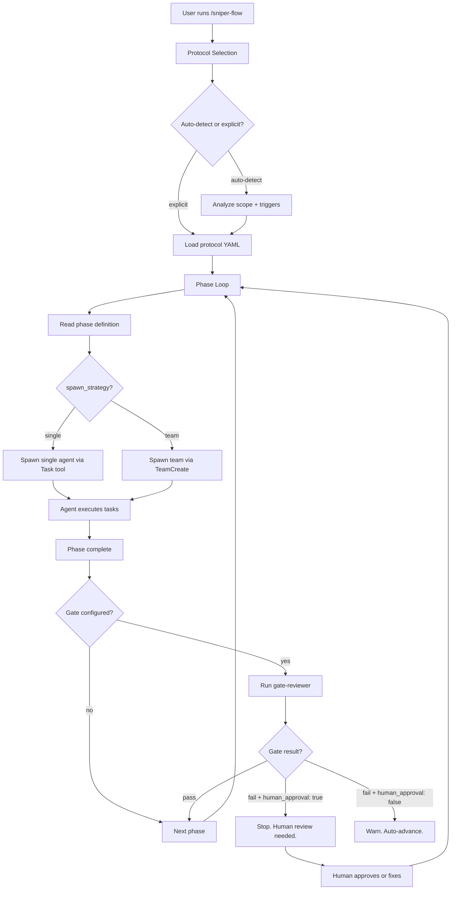

# Architecture

How SNIPER maps its abstractions to Claude Code primitives, and how the components fit together.

## Claude Code Primitives

SNIPER is built on four Claude Code capabilities:

| Claude Code Primitive | SNIPER Abstraction |
|----------------------|-------------------|
| **Skills** (SKILL.md files → slash commands) | `/sniper-flow`, `/sniper-init`, `/sniper-status`, `/sniper-review` |
| **Subagents** (custom agents with tool restrictions) | Agent definitions in `.sniper/agents/` |
| **Agent Teams** (shared task list, mailbox messaging) | Team YAML files in `.sniper/teams/` |
| **Hooks** (PreToolUse, PostToolUse, Stop events) | Hook definitions in `.sniper/hooks/` |

This means SNIPER runs natively inside Claude Code -- no external runtime, no separate UI, no background processes. The framework is a set of files that Claude Code reads and executes.

## Execution Flow



## The Lead-Orchestrator Pattern

The lead-orchestrator is the central coordinator. It reads the codebase and protocol definitions but **never writes source code**. Its write scope is limited to `.sniper/` files only (checkpoints, live-status, gate results).

This read-only pattern (inspired by Roo Code's zero-capability orchestrator) prevents the coordinator from accidentally modifying the codebase while making delegation decisions. It:

1. Reads the protocol definition
2. Reads the current checkpoint (if resuming)
3. Determines which phase to execute
4. Reads team YAML to know which agents to spawn
5. Composes spawn prompts from persona layers
6. Spawns agents (single or team)
7. Monitors progress via the task list
8. Triggers gate evaluation at phase boundaries
9. Writes checkpoints after each phase

## Agent Definitions

Each agent in `.sniper/agents/` has YAML frontmatter specifying its tools and write scope:

```yaml
---
tools:
  - Read
  - Write
  - Edit
  - Bash
  - Glob
  - Grep
write_scope:
  - "src/backend/"
  - "src/api/"
  - "tests/"
---

# Backend Developer

You are a backend developer specializing in server-side implementation...
```

Key constraints:

| Agent | Model | Write Scope | Key Restriction |
|-------|-------|-------------|-----------------|
| lead-orchestrator | Opus | `.sniper/` only | Never writes source code |
| analyst | Sonnet | `docs/`, `.sniper/` | Read-only for source code |
| architect | Opus | `docs/` | Design only, no implementation |
| fullstack-dev | Sonnet | Configured per ownership | Cannot modify infra |
| code-reviewer | Opus | `docs/` | Read-only for source code |
| gate-reviewer | Haiku | `.sniper/gates/` | Only writes gate results |

## Protocol State Machines

Each protocol is a YAML state machine defining the phase sequence:

```yaml
name: full
description: Complete project lifecycle
budget: 2000000

phases:
  - name: discover
    agents: [analyst]
    spawn_strategy: single
    gate:
      checklist: discover
      human_approval: false

  - name: plan
    agents: [architect, product-manager]
    spawn_strategy: team
    gate:
      checklist: plan
      human_approval: true

  - name: implement
    agents: [fullstack-dev, qa-engineer]
    spawn_strategy: team
    plan_approval: true
    gate:
      checklist: implement
      human_approval: true

  - name: review
    agents: [code-reviewer]
    spawn_strategy: single
    gate:
      checklist: review
      human_approval: true
```

### Spawn Strategies

- **`single`** -- one agent spawned using the Task tool. Used for focused work (discovery, code review)
- **`team`** -- multiple agents spawned using TeamCreate. Used for parallel work (planning, implement)

### Gate Evaluation

At each phase boundary:

1. The gate-reviewer agent is spawned
2. It reads the phase's checklist (`.sniper/checklists/<name>.yaml`)
3. It evaluates each check (file existence, grep patterns, command execution)
4. It produces a gate result YAML in `.sniper/gates/`
5. Based on gate configuration (`human_approval`) and results, execution continues or stops

## Checkpoint & Recovery

After each phase, the lead-orchestrator writes a checkpoint:

```yaml
protocol: feature
phase: plan
status: completed
timestamp: "2026-02-28T14:30:00Z"
agents:
  - name: product-manager
    status: completed
    tokens_used: 45000
  - name: architect
    status: completed
    tokens_used: 62000
commits:
  - sha: "abc123"
    message: "plan: PRD and architecture"
total_tokens: 107000
```

If execution is interrupted (timeout, crash, user stops), `/sniper-flow --resume` reads the last checkpoint and resumes from where it left off. Completed phases are not re-run.

## Persona Composition

When an agent is spawned, its context is assembled from multiple sources:

```
┌─────────────────────────────────────────────┐
│              Spawn Prompt                     │
│                                               │
│  ┌─────────────┐  ┌──────────────┐           │
│  │ Process      │  │ Technical    │           │
│  │ (analyst)    │  │ (backend)    │           │
│  └─────────────┘  └──────────────┘           │
│  ┌─────────────┐  ┌──────────────┐           │
│  │ Cognitive    │  │ Domain       │           │
│  │ (security)   │  │ (telephony)  │           │
│  └─────────────┘  └──────────────┘           │
│  ┌─────────────────────────────────┐         │
│  │ Memory (conventions, signals)   │         │
│  └─────────────────────────────────┘         │
│  ┌─────────────────────────────────┐         │
│  │ Task + ownership + implement rules │       │
│  └─────────────────────────────────┘         │
└─────────────────────────────────────────────┘
```

The composition happens at spawn time, not ahead of time. This means the same agent definition can be customized per-project through different memory, domain packs, and ownership rules.

## Hook System

Hooks fire on Claude Code events:

### PreToolUse Hooks

- **Write tool guard** -- blocks the lead-orchestrator from writing outside `.sniper/`

### PostToolUse Hooks

- **Self-healing CI** -- detects test/lint failures in Bash output and instructs the agent to fix before continuing
- **Signal capture** -- auto-captures CI failure patterns to `.sniper/memory/signals/`

### Stop Hooks

- **Gate trigger** -- fires the gate-reviewer at phase boundaries
- **Retro trigger** -- fires the retro-analyst when a protocol completes

## Cost Tracking

Token usage is tracked at multiple levels:

```
Protocol budget (e.g., 800K)
  └── Phase budget (proportional)
      └── Agent tokens (actual usage)
```

Three thresholds control behavior:

| Threshold | Default | Behavior |
|-----------|---------|----------|
| `warn_threshold` | 70% | Log a warning |
| `soft_cap` | 90% | Alert the user, suggest wrapping up |
| `hard_cap` | 100% | Stop execution |

View current cost with `/sniper-status`.

## File Ownership Enforcement

File ownership is a convention, not a hard technical constraint. It works through:

1. **Spawn prompt injection** -- each agent's prompt includes its allowed file paths
2. **PreToolUse hook** -- optionally blocks writes outside ownership boundaries
3. **Code review** -- the reviewer checks that ownership was respected

This layered approach means ownership is enforced at the agent level (instructions), the hook level (guardrails), and the review level (audit).

## Next Steps

- [Core Concepts](/guide/core-concepts) -- the building blocks in detail
- [Why SNIPER?](/guide/why-sniper) -- positioning and comparison
- [Configuration](/guide/configuration) -- configure every aspect of the architecture
